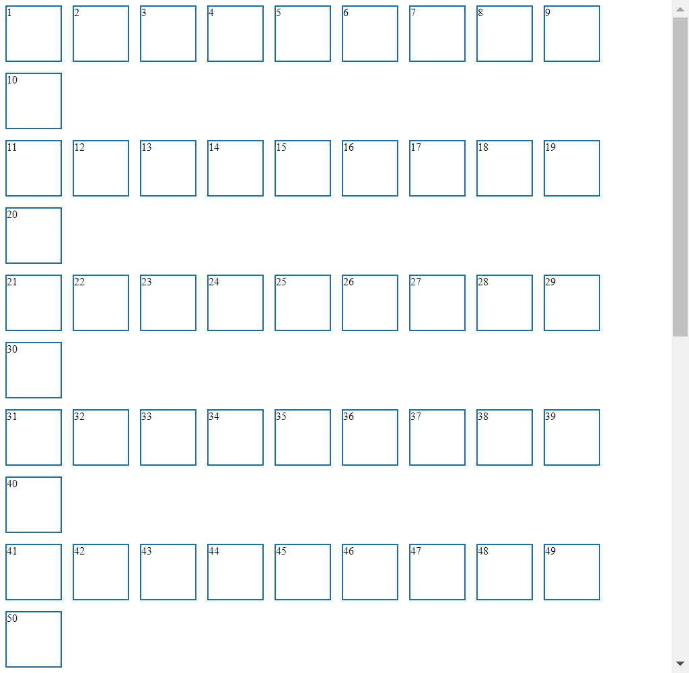

# Testcafe screenshot sizing issue
This small project demonstrates the buggy behavior of the screenshot function in combination with a resize of the browser window.

## Buggy behavior
The tested HTML page in this example is composed of 10 rows of 10 boxes, where every single box is 100px wide.
In this testcafe test the html page is opened, and the headless chrome browser is resized to a certain browser size (1050px, 768px).
With this configuration the browser should be able to display the whole row of 10 boxes, which add up to a with of 1000px.
When we now take a screenshot with the configuration `fullPage: true`, it takes a screenshot with unwanted behavior.
In the example picture, that is provided below, you can see, that the rows are forced into a link break and additionally a scroll bar is shown.
Since we set the fullPage attribute to true, we should see all 100 boxes, but that is not the case.
Besides, a scroll bar should not be been shown, and the row of boxes should not be forced into a line break.

## Reproduce buggy behaviour
```
# Install
npm i

# Run test case
npm test
```

In addition to running the command locally, one can test it with the github actions workflow provided in this project => `.github/workflows/generate_screenshot.yml`.
### Example screenshot

